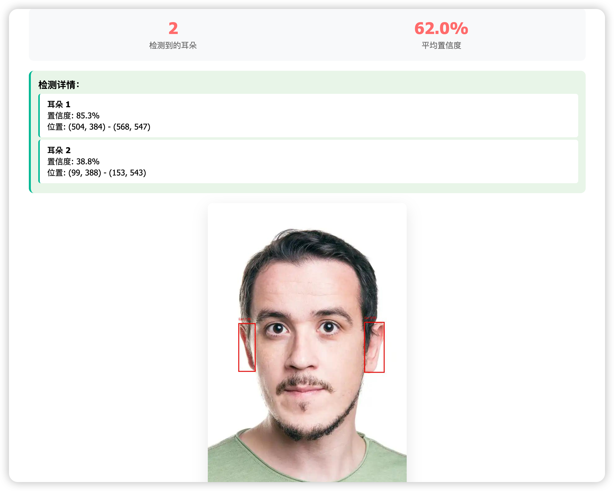
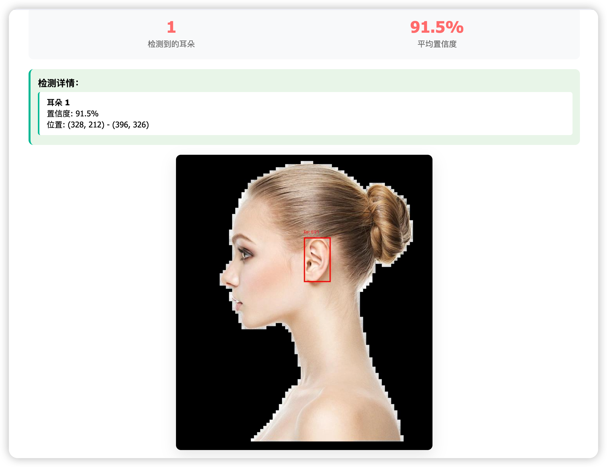
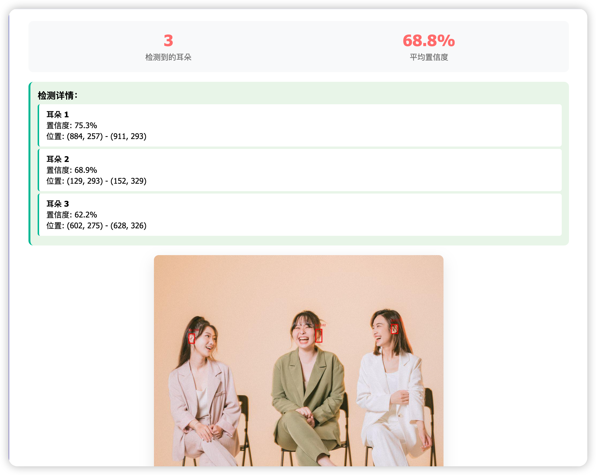

# YOLOv8 耳朵识别

本项目基于 Ultralytics YOLOv8，提供一个耳朵检测的 Web 项目。你可以通过网页上传图片，自动检测并用红色框标记图片中的耳朵。

---

## 检测效果示例

- **单人正面照检测效果：**

  

- **单人侧脸照检测效果：**

  

- **多人场景检测效果：**

  

---

## YOLOv8 简介

[YOLOv8](https://github.com/ultralytics/ultralytics) 是 Ultralytics 公司推出的最新一代 YOLO（You Only Look Once）目标检测模型，具有如下特点：
- 🚀 更快更准：推理速度快，检测精度高，适合边缘设备和服务器部署
- 🧩 支持多任务：不仅支持目标检测，还支持分割、关键点检测、分类等
- 🛠️ 易用性强：API 友好，训练、推理、导出一行命令即可完成
- 📦 社区活跃：官方持续维护，文档丰富，生态完善

---

## 功能亮点
- 🎯 **高精度耳朵检测**：基于自定义训练的 YOLOv8 模型
- 🌐 **Web 界面友好**：支持拖拽/点击上传图片，实时显示检测结果
- 📊 **详细检测信息**：显示检测到的耳朵数量、置信度、位置等
- 🛡️ **易于扩展**：可快速替换模型、迁移到其他目标检测任务

---

## 快速开始

### 1. 创建并激活虚拟环境（推荐）
```bash
python3 -m venv venv
source venv/bin/activate  # Windows下为 venv\Scripts\activate
```

### 2. 安装依赖
```bash
pip3 install -r requirements.txt
```

### 3. 训练模型
```bash
python3 train_ear_yolov8.py
```
### 4. 测试模型
```bash
python3 test_model.py
```

### 5. 启动 Web 应用
```bash
python3 app.py
```

应用默认运行在 [http://localhost:8011](http://localhost:8011)

---

## 数据集与权重说明
- **数据集**：本项目未直接包含训练/验证/测试图片。请根据 `ear-data.yaml` 格式准备自己的数据集，或联系作者获取公开样例。
- **模型权重**：`best.pt`、`yolov8n.pt` 等大文件未上传。请自行训练或下载后放入项目根目录。

---

## 使用方法
1. 打开浏览器访问 [http://localhost:8011](http://localhost:8011)
2. 上传图片（支持 JPG/JPEG、PNG、GIF、BMP、WEBP）
3. 查看检测结果，耳朵会被红色框标记，页面显示检测数量和置信度

---

## 常见问题
- **模型加载失败**：请确保 `best.pt` 文件存在且完整，依赖包已正确安装
- **图片上传失败**：请检查文件格式和大小（不超过16MB）
- **检测结果为空**：可能图片中没有耳朵，或图片质量不佳，或模型泛化能力有限

---

## 开源协议

本项目采用 **Apache-2.0 License** 开源协议，详见 LICENSE 文件或[官方说明](https://www.apache.org/licenses/LICENSE-2.0)。

---

如有建议或问题，欢迎提交 Issue 或联系作者。 